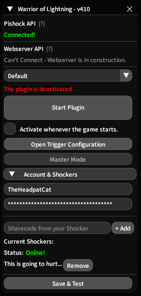
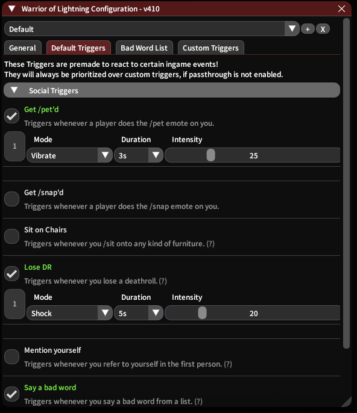

# A FFXIV Plugin that integrates PiShock devices into the Game.

You have to use the [XIVQuicklauncher](https://goatcorp.github.io/) with Dalamud enabled for this to work.

### Warning! This is a still in a prototype phase - Expect things to go wrong!

If any problems or Questions or even suggestions come up, simply write me a message on discord!
I go by `theheadpatcat`  
Or if you want to be fancy, open a Issue. That also works.

## Current Features
 - Social Triggers:  
 Getting /pet'd  
 Getting /snap'd at (By [thattuys](https://github.com/thattuys))  
 Sitting on Furniture  
 Losing a Deathroll  
 Saying specific phrases/words or not saying them  
 
 - Combat Triggers:  
 Party Wipes  
 Dying  
 Any Partymember dying  
 Failing Mechanics  
 Taking Damage (Proprtional calculation supported)  
 
- Creation of Custom Triggers (By [Lexiconmage](https://github.com/lexiconmage))

- Preset profiles    
- Master Mode [CURRENTLY DISABLED]  
  Allows another player to take control over your Configuration.
- A safeword with /red  
  This disables all Pishock functionality from the plugin until used again.
 
  
  

## Installation:

Ingame, open the Dalamud Settings, navigate to the "Experimental" Tab and scroll down.
There you find "Custom Plugin Repositories" - Important do not mix this up with "Dev Plugins" at the top!  
You will then have to enter this link into the list:  
`https://raw.githubusercontent.com/TheHeadPatCat/DalamudPlugins/main/repo.json`  
Save it via the plus sign on the right and then the floppy disk on the bottom right.
Then, open the Plugin Installer and search for "Warrior of Lightning"

## Usage

Once installed, you can open the Main Menu.
Here you can enable or disable the entire Plugin at any point - this is so it only actually shocks you when you are ready for it.
Alternatively, there is a fast way to disable it using the command `/red`, this will instantly stop all operations and ignores all Settings - until used again.
Lastly, the "Activate whenever the game starts" is there to automatically activate the plugin right away, when you login.

Firstly, on the very bottom, you need to put in your PiShock Username, then a sharecode from your shocker as well as your API Key.
- Username is simple enough: It's just what you login to Pishock with.
- The Sharecode can be get from the big "Share" button on your shocker, press that and click on "+ Code". Then copy that and put it into the box.
- API Key is found in the menu at the very top right, under "Account". You can generate one here, if you have never used one before, otherwise use your existing one that you have saved somewhere (otherwise other integrations will lose their key)

To finish it off, press the "Save & Test" button and see if your shockers vibrate within around 3 seconds!  

## Configuration

After you have gotten all of this behind you, you can start customizing your experience!
Simply enable whichever trigger you like and set the according values to your liking.
Every trigger gives you the option to choose between the three modes: "Shock", "Vibrate" and "Beep"
Intensity and Duration can also be set.

